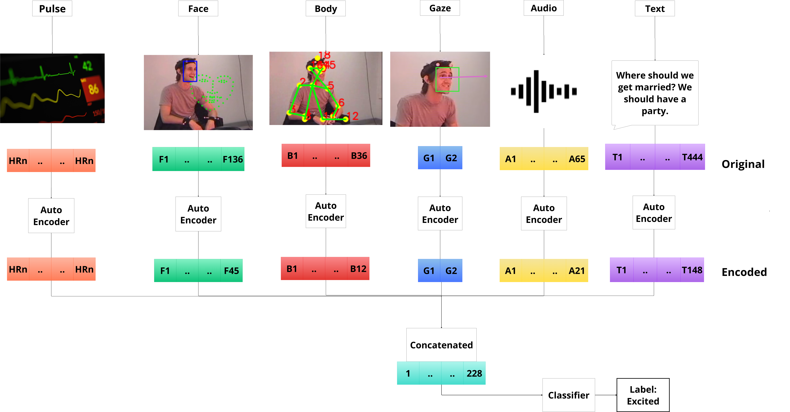

# From-Modal-Fusion-to-Model-Selection-Practical-Evaluation-for-Emotion-Understanding-in-HRI

This is the repository for the paper:
From Modal Fusion to Model Selection: Practical Evaluation for Emotion Understanding in HRI

Results can be found in the results folder, seperated into folders based on their contents.

To run the framework, you will need to obtain the data from the datasets and obtain the features(face,body,gaze and audio). Then these can be combined with the transcripts to use for testing. 

The framework has an autoencoder function that can encode the features for you, or use the included encoder models. The text modality will need to encoded as this was not included. 

Once the autoencoders are set up, the framework can be used to test any numbers of combinations of modalities and classifiers.

The full data can be found at: https://www.dropbox.com/scl/fi/yhdrhnlhyhgqlk8e0n6vx/IEMOCAP-AFFWILD.csv?rlkey=zf0yjyy2wuq8t6677d88akkim&st=kov9awt6&dl=0
